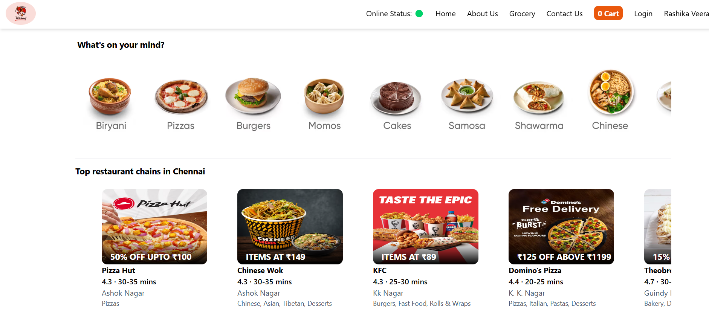
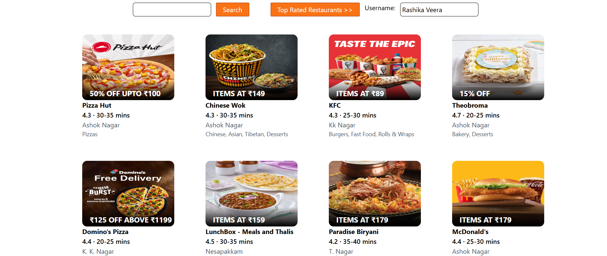
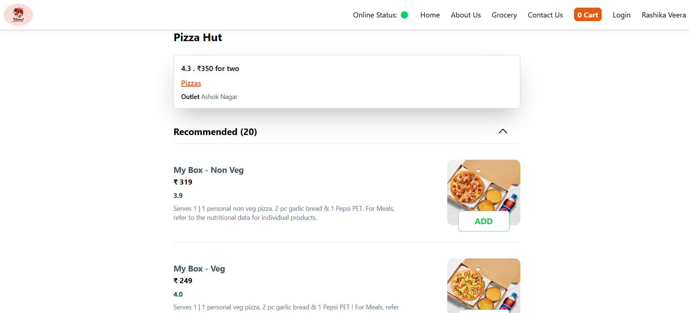
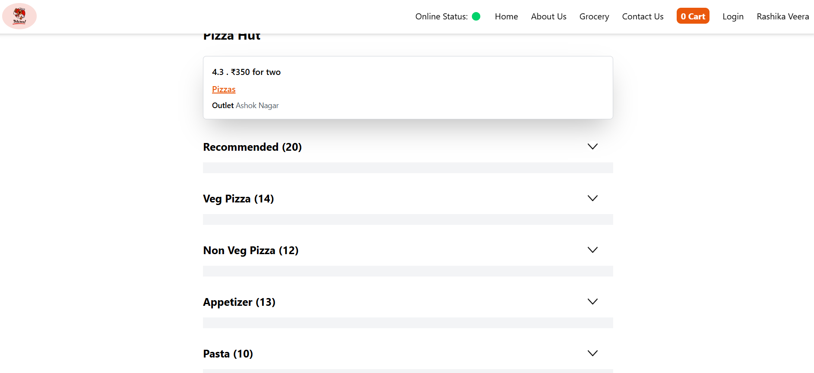
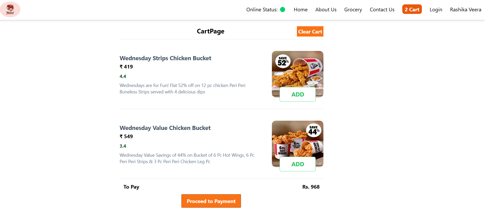

# GrabNGo - React App

[Visit the Website](https://grabngooo.netlify.app/) Enable CORS Plugin to use it 

## Overview

GrabNGo is a food delivery application built with **React** and optimized for performance. It features a responsive layout, search functionality, restaurant listing, and more, offering a smooth user experience. The project uses **Parcel** for bundling and optimization, and integrates key modern web development practices.

## Key Features

### **Technology Stack**
- **React** for building dynamic user interfaces.
- **Parcel** for bundling, optimizations, and fast build performance.
- **Redux Toolkit** for state management.
- **React Hooks** for managing state and side effects.
- **Jest & React Testing Library** for testing.

### **Features**
1. **Header**
   - Logo and Navigation items for easy navigation across the site.

2. **Search Functionality**
   - Search bar to look for restaurants.

3. **Restaurant Container**
   - Displays a list of restaurants with their details.

4. **Restaurant Card**
   - Image, Name of the restaurant, Star Rating, Cuisine type, and Delivery time for each restaurant.

5. **Footer**
   - Copyright information, useful links, and contact details.

### **Routing**
- **Client-Side Routing**: Navigates between components without full page reloads.
- **Server-Side Routing**: Server determines which pages to send based on the request.

## React Hooks
- **useState()** : Manages state in function components.
- **useEffect()**: Handles side effects like data fetching and subscriptions.

## State Management with Redux Toolkit
## Install Dependencies:

```
npm install @reduxjs/toolkit react-redux
```

- Create the Store: Set up Redux store and integrate it with your React app.
- Slices (e.g., Cart Slice): Create slices of state and actions for managing the cart, products, etc.
- Dispatch Actions & Selectors: Use dispatch(action) to modify the state and useSelector to get data from the store.

## Screenshots:

Home Page




## Restaurants Page:




## Cart Page



## Watch the Video :

[](https://youtu.be/cty3Ghmp144)

